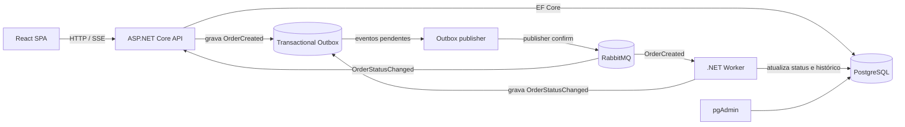

# Arquitetura e fluxo de pedidos

## Visão geral

O sistema é um monólito modular implantado em processos independentes. A API atende HTTP e mantém o estado do pedido. O Worker executa o processamento assíncrono. Ambos compartilham domínio, aplicação, infraestrutura e contratos, mas não compartilham processo nem responsabilidade operacional.

## Fluxo confiável

1. A API valida o comando e cria o pedido como `Pendente`.
2. Pedido e `OrderCreated` são persistidos na mesma transação PostgreSQL.
3. O publicador em background seleciona uma mensagem pendente com `FOR UPDATE SKIP LOCKED`.
4. Após confirmação do RabbitMQ, a mensagem é marcada como publicada. Falhas recebem backoff exponencial e erro sanitizado.
5. O Worker reconhece a entrega somente após persistir o efeito. Ele move o pedido para `Processando`, espera cinco segundos e o move para `Finalizado`.
6. Cada mudança gera histórico imutável e um `OrderStatusChanged` na outbox.
7. A API retransmite a mudança por SSE; se o stream estiver indisponível, o frontend consulta apenas pedidos ainda em processamento.

A entrega é *at-least-once*: uma interrupção após a confirmação do broker pode reenviar o evento. A idempotência do consumidor impede regressão de estado ou duplicação de histórico.

## Limites operacionais

- O Compose é destinado à demonstração local; as portas publicadas são limitadas a `localhost`.
- O Management UI do RabbitMQ existe somente para observação local.
- O SSE funciona diretamente para uma instância de API. Uma implantação horizontal exigirá fan-out por instância ou um backplane.
- O exportador OpenTelemetry de console é demonstrativo. Em produção, deve ser substituído por um collector OTLP.
